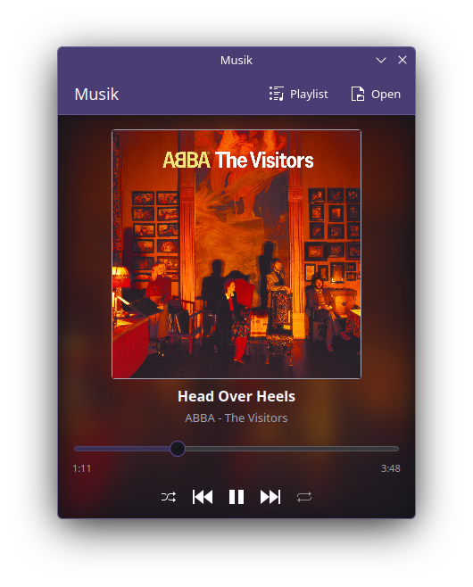
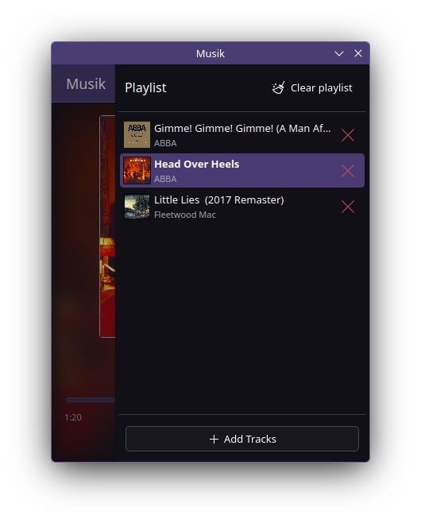

  
  
  # Musik
  
  **Simple audio player for KDE Plasma**
  
  A lightweight native KDE application for playing your music
  

---

## About

Musik is a native KDE application that provides a simple and intuitive audio playback experience. Built specifically for the KDE Plasma desktop environment, it integrates seamlessly with your workflow.

### Features

- **Simple interface** - Clean and intuitive design built with Kirigami
- **Native KDE integration** - Built with Qt/QML for seamless Plasma desktop experience
- **Audio playback** - Support for common audio formats
- **Lightweight** - Minimal resource usage for quick music playback

## Installation

### Building from Source

For build instructions, see [BUILD.md](BUILD.md).

## Screenshots

## License

This project is licensed under the GPL-3.0 License - see the LICENSE file for details.
